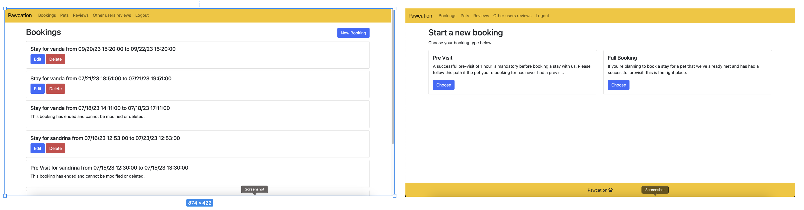

# Pawcation

Pawcation is a website addressed to dog owners offering hotel services for dogs, 24/7. Having a dog is wonderful but we all know how hard it can be, at times,  to find a safe place for our furry friends when we are not around.Enters Pawcation, a small business that offer safe stays so that our dogs are treated well until we get back. 


The live link to my project is here: https://pawcation.herokuapp.com/
___
# UX Design

In Pawcation I have tried to build a very user friendly app,that guides the user via buttons and forms to perform the actions they want to perform on the platform in order to book, update, delete and review stays for their dogs.The app is easy to navigate and in order to make every action count, the user  will get confirmation every time an action is performed letting them know if it's successfull or if an error occured. They will also receive details on how to fix such errors to proceed. The design picked here is minimal, the main image is a cartoonish drawing that most people loving animals will enjoy and that makes the scope of the app clear even before reading. I have then picked a bright yellow for the nav bar and the footer to give a bit of color to the page and also match the hotel image.

## Navigation 

### Navigation Bar 
The navigation bar is dynamic based on if the user is logged in or not. To make it convenient for logged in users to get back to their list of bookings (which is the main thing a logged in user wants to do) the `Pawcation` site name link changes after login to always give the user an easy way to get back to the bookings page. Users that haven't logged in would be redirected to the home or welcome page instead. 

### Navigating to and from forms 
Each main page has a similar structure. Bookings, Reviews, and Pets all show lists and have a button which takes users to a form to create a new booking, review, or pet. Users are then able to either submit the form or go back to where they came from via a `Cancel` button that is present on every from. This means that users will find it easy to use the various different parts of the app as they all look and behave in a consistent way. 
A similar pattern is present for editing existing content. All content (booking, review, pet) shown in the lists also contains links to either edit or delete the content. Again, users will be directed to a form (or deletion screen) based on their action from which they can complete the action or return. 


## Wireframes 
Wireframes for the project were created using Figma and can be viewed on Figma [here](https://www.figma.com/file/G1KsEzPmiHHn6TrtWUEKh2/Pawcation-Wireframes?type=design&node-id=4%3A376&mode=design&t=t87crDcdStwRB99v-1)


## Database Design 
I designed the Database using LucidChard. A link to the document is [here](https://lucid.app/lucidchart/2d227d87-755c-4bae-a0cb-cd0d41d74134/edit?viewport_loc=-720%2C-515%2C1875%2C903%2C0_0&invitationId=inv_8b495c89-08df-4f9f-bb0c-868687f2bdb8)


## Agile 
In this project I have used the agile method, a link to the Github project and stories can be found [here](https://github.com/users/ilaria-barletta/projects/2/views/1)

# Technologies Used
* Django 
* HTML5 
* CSS 
* Bootstrap 5 
* Python 
* ElephantSQL 
* Cloudinary 
* FontAwesome 

___
# Features 
__Homepage__: 

This is the main page that the user sees before registering or logging in. 
The content is centered and the style is clean and simple. 
There is a navigation bar and a footer.
The navigation bar at this stage contains only the name of the website (it works as a link to the homepage as well if the buttons present in the page are clicked and the user wants to go back to the main screen).
The navigation bar will change and provide links to additional pages only after the user has registered or logged in to their account.
A quick but clear in the scope message to the user informs them of what pawcation is. 
The message contains a link that if clicked will show reviews left by other customers.
There are then 2 buttons that let the user register if they are new or log in if they are known users. 

__All reviews__: 

__Register__: 

This is the first option the user has and can click on in order to provide their details to access the service. 
When clicked the user will be taken to a form page where some details will be requested. 
In particular they will be asked to provide username and password. An email can be also provided but that's optional. 
The password needs to be selected once and then typed it again for confirmation. 

__Successfully registered__:

When the process is complete and the user selects register they are shown a screen where options are listed in the nav bar. 
A pop up message saying "succesfully signed in" is showed to them  

__Log in__: 

Alternatively the user that already has an accound can just log in into it selecting the relevant button. 
In such case they will be asked to type in their username and password and both fields are mandatory. 

__Succesfully logged in__: 

__Pets__: 


__Bookings__: 


__Reviews__: 


__Other users reviews__: 

__Sign out__: 


___
# Testing 

## User stories testing / manual testing 

I have tested the app thoroughly and you can see the outcome of the manual testing below where I've detailed each feature tested in separate tables. You can also see the user story in Github which contains the acceptance criteria which aided the testing. 

1. Homepage: [Github Story](https://github.com/users/ilaria-barletta/projects/2/views/1?pane=issue&itemId=33380452):

| Test        | Outcome     |
| ----------- | ----------- |
| The homepage clearly describes what pawcation is for so users clearly understand if they're in the right place       | Pass        |
| Register button is present and takes user to register form        | Pass        |
| Log in button is present and takes user to log in form      | Pass        |
| Link to reviews present, if clicked user is taken to a list of all the reviews present on the platform       | Pass        |


2. All reviews: [Github Story](https://github.com/users/ilaria-barletta/projects/2/views/1?pane=issue&itemId=33458012):

| Test        | Outcome     |
| ----------- | ----------- |
| All reviews page is accessible from the reviews link present in homepage       | Pass        |
| All reviews shows all the reviews left by existing customers of  pawcation       | Pass        |
| Reviews cannot be edited       | Pass        |
| Reviews cannot be deleted       | Pass        |
| Each review shows the following details: score, pet name, date, time and name of the user     | Pass        |


3. Site registration [Github Story](https://github.com/users/ilaria-barletta/projects/2/views/1?pane=issue&itemId=30571231): 

| Test        | Outcome     |
| ----------- | ----------- |
| Register form has username, password and email fields       | Pass        |
| Username and password are mandatory fields       | Pass        |
| If pass and confirm pass do not match, error msg shows       | Pass        |
| Button to register present and working       | Pass        | 
| Register button takes to bookings       | Pass        | 
| Button to cancel present and working       | Pass        | 
| Cancel button takes user to homepage       | Pass        | 

4. Site login: [Github Story](https://github.com/users/ilaria-barletta/projects/2/views/1?pane=issue&itemId=30571430):

| Test        | Outcome     |
| ----------- | ----------- |
| Log in form presents username and password as mandatory fields       | Pass        |
| if user provides wrong username/password, error msg shows   | Pass        |
| Button to  Login present and working      | Pass        |
| Login button takes to bookings       | Pass        |
| Button to cancel present and working | Pass        |
| Cancel button takes user to  Homepage      | Pass        |

5. Add Pet Details: [Github Story](https://github.com/users/ilaria-barletta/projects/2/views/1?pane=issue&itemId=30571658):

| Test        | Outcome     |
| ----------- | ----------- |
| Name, age, breed, allergies, notes are all mandatory fields in form      | Pass        |
| The image field in the form is not mandatory and a placeholder will be used if user doesn't add one       | Pass        |
| Dogs can be max 12 years old to use pawcation services, error msg shows if age selected is >12       | Pass        |
| Button to submit is present and creates the pet and takes the user back to the pet list where the newly added pet is shown when clicked | Pass        |
| Button to cancel is present and takes the user back to the pet list when clicked       | Pass        |

6. View Pet List: [Github Story](https://github.com/users/ilaria-barletta/projects/2/views/1?pane=issue&itemId=31068112):

| Test        | Outcome     |
| ----------- | ----------- |
| Every pet the user has registered is shown       | Pass        |
| Pet name and profile picture are shown      | Pass        |
| If a pet doesn't have a profile picture a placeholder is shown       | Pass        |
| Pets that other users have registered should not be shown to the user      | Pass        |
| The user should have the option to edit or delete pets    | Pass        |
| The "edit" option on a pet should take the user to the pet details form with the pets details filled in    | Pass        |
| The "delete" option on a pet should take the user to the delete pet page    | Pass        |

7. Update Per Details: [Github Story](https://github.com/users/ilaria-barletta/projects/2/views/1?pane=issue&itemId=30571798):

| Test        | Outcome     |
| ----------- | ----------- |
| Name, age, breed, allergies, notes are all mandatory fields in form      | Pass        |
| The image field in the form is not mandatory and a placeholder will be used if user doesn't add one     | Pass        |
| The form has each field pre-filled with the existing details of the pet to update      | Pass        |
| The submit button should take the user back to the pet list and save the changes made to the data in the form       | Pass        |
| The cancel button should take the user back to the pet list without saving any of the changes they did to the data in the form     | Pass        |

8. Delete Pet: [Github Story](https://github.com/users/ilaria-barletta/projects/2/views/1?pane=issue&itemId=33380253):

| Test        | Outcome     |
| ----------- | ----------- |
| The page confirms if the user would like to delete the pet and shows the name of the pet to be deleted       | Pass        |
| The delete button will delete the pet and will take the user back to the pet list where the pet just deleted will no longer be visible       | Pass        |
| The cancel button will take the user back to the pet list ignoring the previous delete request.       | Pass        |


9. Booking type selection: [Github Story](https://github.com/users/ilaria-barletta/projects/2/views/1?pane=issue&itemId=33381567):

| Test        | Outcome     |
| ----------- | ----------- |
| Start a new booking presents the user with two options: pre-visit or full booking       | Pass        |
| Each option is briefly described and has a choose button       | Pass        |
| The choose button in the previsit box takes the user to the new pre-visit form       | Pass        |
| The choose button in the full booking box takes the user to the new full booking form     | Pass        |


10. Create a pre-visit booking: [Github Story](https://github.com/users/ilaria-barletta/projects/2/views/1?pane=issue&itemId=30571928):

| Test        | Outcome     |
| ----------- | ----------- |
| The user can select the start date and the time for their previsit       | Pass        |
| The start date must be in the future (at least tomorrow)     | Pass        |
| The user can select the pet they are booking the pre-visit for from the dropdow list showing all the pet that particular user has registered on the platform       | Pass        |
| The user can book only one previsit per pet. If the pet has already completed a previsit or has one booked and not yet completed then an error message will be shown giving information regaring the policy (just one previsit per pet) and the instruction to edit the future pre-visit already booked       | Pass        |
| The submit button should take the user back to bookings where the new pre-visit booked will be visible       | Pass        |
| The cancel button will take the user back to bookings   | Pass        |


11. Create a stay booking: [Github Story](https://github.com/users/ilaria-barletta/projects/2/views/1?pane=issue&itemId=30571943):

| Test        | Outcome     |
| ----------- | ----------- |
| The user can select the start date, end date (date and time) for their booking     | Pass        |
| The start date must be in the future (at least tomorrow)     | Pass        |
| The user can select the pet they're planning to book for from the dropdown list of pets. The list of pets shows all the pets the logged is user has added to their account.        | Pass        |
| The user cannot book a stay for more than 30 days        | Pass        |
| The user cannot book a stay for less than 1 hour     | Pass        |
| The user cannot book a stay for a pet that has not yet completed a pre-visit      | Pass        |
| The user cannot book a stay if there are already 2 bookings present in the system for that same date they're trying to book for     | Pass        |
| The submit button will take the user to the booking page where the new booking will be listed along with the other bookings the user mighy have       | Pass        |
| The cancel button will take the user back to the booking page       | Pass        |

12. Create a stay booking - date validation: [Github Story](https://github.com/users/ilaria-barletta/projects/2/views/1?pane=issue&itemId=30572301)
& Create a stay booking - pet capacity validation: [Github Story](https://github.com/users/ilaria-barletta/projects/2/views/1?pane=issue&itemId=30572465):

| Test        | Outcome     |
| ----------- | ----------- |
| clicking on submit, if the date the user is booking for is not available due to limited capacity, an error message is shown and the user is asked to book for a different date        | Pass        |

13. View booking list: [Github Story](https://github.com/users/ilaria-barletta/projects/2/views/1?pane=issue&itemId=31068173):

| Test        | Outcome     |
| ----------- | ----------- |
| The booking page shows all the booking a user has in their account past and future       | Pass        |
| The completed bookings cannot be edited or modified       | Pass        |
| The bookings show the name of the pet they are for and the time they are for       | Pass        |
| Bookings that are not completed yet present the option to be edited       | Pass        |
| Booking that are not completed yet present the option to be deleted       | Pass        |


14. Update a booking: [Github Story](https://github.com/users/ilaria-barletta/projects/2/views/1?pane=issue&itemId=33384945):

| Test        | Outcome     |
| ----------- | ----------- |
| All the bookings that are not completed yet in the booking page present the option to be edited      | Pass        |
| the edit button takes the user to the update booking form       | Pass        |
| the field in the update booking form are prefilled with the choices the user originally made. they can be edited.       | Pass        |
| The submit button takes the user back to bookings and shows the updated details of the booking       | Pass        |
| The cancel button takes the user back to bookings     | Pass        |

15. Delete a booking: [Github Story](https://github.com/users/ilaria-barletta/projects/2/views/1?pane=issue&itemId=33380250):

| Test        | Outcome     |
| ----------- | ----------- |
| All the bookings that are not completed yet in the booking page present the option to be deleted.         | Pass        |
| The page confirms if the user would like to delete the booking and shows the name of the pet, the type of bookings and the time to be deleted       | Pass        |
| The delete button will delete the booking and take the user back to the bookings page where the deleted booking will no longer be visible       | Pass        |
| The cancel button will take the user back to the booking page       | Pass        |


16. Create a property review: [Github Story](https://github.com/users/ilaria-barletta/projects/2/views/1?pane=issue&itemId=30573214):

| Test        | Outcome     |
| ----------- | ----------- |
| The user can navigate to the new review form using the new review button         | Pass        |
| The form presents fields for score and booking and are both mandatory     | Pass        |
| The scoring system goes from 1 to 5, if a user provides a different score, a message tells them to select a value that is less than or equal to 5      | Pass        |
| The booking fields shows a dropdown list of stays that includes only the bookings that have been completed       | Pass        |


17. View property reviews: [Github Story](https://github.com/users/ilaria-barletta/projects/2/views/1?pane=issue&itemId=30573713):

| Test        | Outcome     |
| ----------- | ----------- |
| My reviews presents a list including all the reviews left by the logged in user        | Pass        |
| Other users reviews do not show       | Pass        |
| The reviews show the pet name, the type of booking and the date they refer to       | Pass        |
| The reviews present the option to be edited or deleted       | Pass        |


18. Update a property review: [Github Story](https://github.com/users/ilaria-barletta/projects/2/views/1?pane=issue&itemId=30573463):

| Test        | Outcome     |
| ----------- | ----------- |
| The edit button shown for each one of the reviews the user has left, takes them to the update review form       | Pass        |
| The fields of the form are pre-filled with the same data the user left in the first place       | Pass        |
| The score can be modified but it can again be only a number from 1 to 5       | Pass        |
| The submit button takes the user back to my reviews where the new score is shown       | Pass        |
| The  cancel button takes the user back to the reviews list     | Pass        |


19. Delete a property review: [Github Story](https://github.com/users/ilaria-barletta/projects/2/views/1?pane=issue&itemId=31201677):

| Test        | Outcome     |
| ----------- | ----------- |
| All the reviews in the "my reviews" list present a delete button       | Pass        |
| The page confirms if the user would like to delete the reviews and shows the name of the pet, the type of bookings,  the time and the username of the review to be deleted       | Pass        |
| The delete button will delete the review and take the user back to the reviews page where the deleted review will no longer be visible       | Pass        |
| The cancel button will take the user back to the reviews page       | Pass        |


20. View other users review: [Github Story](https://github.com/users/ilaria-barletta/projects/2/views/1?pane=issue&itemId=31201743):

| Test        | Outcome     |
| ----------- | ----------- |
| Other user reviews page presents a list of all the reviews present in the system exluding the reviews left by the logged in user       | Pass        |
| Each review presents the following info: score, booking type, pet name, date and time, name of user that left the review        | Pass        |
| Other users reviews cannot be edited or deleted       | Pass        |

21. Success/Error messages: [Github Story](https://github.com/users/ilaria-barletta/projects/2/views/1?pane=issue&itemId=32346104):

| Test        | Outcome     |
| ----------- | ----------- |
| Register form correctly filled takes user to booking, "successfully signed in" message shows.        | Pass        |
| Log in form correctly filled takes user to booking, "successfully signed in" message shows.       | Pass        |
| Pre-visit form correctly filled shows: Your pre-visit has been added successfully.       | Pass        |
| Full booking successful shows:Your full booking has been added successfully.       | Pass        |
| Booking request for dates already full (no capacity) shows: We don't have enough space for those dates. Please choose different dates       | Pass        |
| Booking requests for less than 1 hour show: The booking must end at least an hour after the start date| Pass
| Booking requests for more than 30 days show: You have chosen to book for too many days. Please choose at most 30 days         | Pass        |
| Pre-visit form filled for a pet that has already a pre-visit booked but not yet happened shows: You have already booked a pre-visit for this pet, and cannot book another. If you would like to change the one you have booked, please visit the bookings page and edit your existing pre-visit. Please note that if your pet has already completed a pre-visit, you won't be able to book another one. Only one pre-visit is allowed per pet.       | Pass        |
| Edit pre-visit if successful shows:Your pre-visit has been updated successfully.       | Pass        |
| Delete your pre-visit shows:Your booking has been deleted successfully. | Pass        |
| Edit your full booking if successful shows: Your full booking has been updated successfully.| Pass        |
| Delete your full booking shows: Your booking has been deleted successfully.  | Pass        |
| Add your pet shows: Your pet has been added successfully.| Pass        |
| Edit your pet shows: Your pet has been updated successfully.| Pass        |
| Delete your pet shows: Your pet has been deleted successfully. | Pass        |
| Add a review:Your review has been added successfully. | Pass        |
| Update a reviews: Your review has been updated successfully| Pass        |
| Delete a review:Your review has been deleted successfully | Pass        |
| If user tries to review a visit already reviewed, the following message shows: You have already reviewed this booking and cannot review it again. If you would like, you can edit your existing review  | Pass        |
| Log out shows: You have signed out.| Pass        |


22. User authorization: [Github Story](https://github.com/users/ilaria-barletta/projects/2/views/1?pane=issue&itemId=30572644):

| Test        | Outcome     |
| ----------- | ----------- |
| Users cannot book a stay unless they are logged in | Pass       
| Users cannot upload pet details without being logged in.| Pass        |
| Users need to have created their pet details to be able to book a stay. | Pass        |
| Users can only manage their own pet details and bookings and not those of other users | Pass        |
| Users can only manage their own reviews and not those of other users.  | Pass        |

## Fixed Bugs
`1`

**Expected** : Users should only be able to review bookings that have ended. 


**Testing** : When creating a review on the review page, the list of bookings in the `booking` field dropdown should only include bookings that are in the past, and not in the future. 


**Result** : The `booking` field dropdown included all bookings, even those that were dated to start in the future. 


**Fix** : To fix this I updated the `queryset` for the `booking` field in the `ReviewForm`. I made use of Django's `__lte` date query helper and I added a check to make sure the end date of the booking is in the past: `Q(end_date__lte=datetime.datetime.now())` 

`2`

**Expected** : Users should not be able to modify bookings that have ended. 


**Testing** : The booking list shows `edit` and `delete` buttons for bookings. These buttons should only be visible when the booking has ended. 


**Result** : The `edit` and `delete` buttons were visible for all bookings, even those that had already ended. 


**Fix** : I added a `has_ended` function to the `Booking` model and then used that in the template to hide the buttons if the `has_ended` function returned `True`. 

`3`

**Expected** : Users should not be able to edit or delete the bookings/reviews/pets of other users 


**Testing** : I created two different bookings for two different users. When editing a booking I changed the URL to include the `id` of the booking belonging to the other user. This should not have worked. 


**Result** : The user was able to access the booking of the other user and update it. 


**Fix** : To fix this I added a `get_object` function to the view that checked the `owner` of the booking against the logged in user. If the check didn't match I redirected the user to a `404` page so they could not see the content of the other user. Below is an example of the code: 

```
def get_object(self, *args, **kwargs):
    obj = super(UpdateReview, self).get_object(*args, **kwargs)
    if not obj.owner == self.request.user:
        raise Http404
    return obj
```

`4`

**Expected** : Logged in users should get directed to the `Bookings` page as their home page and should not be able to get back to the home page that contains `Register` and `Login` buttons. 


**Testing** : When testing as a logged in user I clicked the site name in the navigation bar, which redirects users back to the home page if they are not logged in or to the bookings page if they are logged in. 


**Result** : Clicking the link took me to the home page where I could click on the buttons to login or register. Since I was already logged in this did not make any sense for the user. 


**Fix** : To fix this I added logic to the navigation bar to check if the user is logged in (`user.is_authenticated`) and if so, change the URL for the site name to go to `bookings` instead of `home`. 

## Remaining Bugs 
`4`

**Expected** : Users should not be able to make multiple bookings for the same pet with dates that overlap


**Testing** : When testing the booking form I created several bookings with different dates. I was able to create two different bookings for the same pet with dates that overlapped e.g 

First Booking: 18.07.2023 -> 18.07.2023
Second Booking: 16.07.2023 -> 23.07.2023


**Result** : I was able to successfully create both bookings and the app didn't prevent the second booking being made with overlapping dates. 


**Needed Fix** : To fix this I would need to add to the existing validation logic in the booking form to handle this case. As there is already a lot of validation, and this case is not likely to cause issues for users as they already know when they have bookings clearly from the UI, then I have decided to leave this out of the MVP. This is something that could be planned for the future.  


## Validators:
 * [html](https://validator.w3.org/#validate_by_input) testing: I have tested html and the validator returned no errors: 


 * [css](https://jigsaw.w3.org/css-validator/) testing: I have tested css and the validator returned no errors:
 

 * [python](https://pep8ci.herokuapp.com) testing
 * lighthouse testing: I have tested pawcation with lighthouse both for app and mobile. Result is here visible: 


# Deployment, Forking and Cloning 

## Deployment
The project has been deployed using Heroku. Here are the step to follow for the deployement:

1. Access your Heroku account and click on "create a new app", name the app and select the region before hitting the create app button.   
2. Navigate to the settings tab and create config vars for cloudinary, the database, and the secret key
3. Navigate to the deploy section and select Github as deployment method. After confirming that we want to connect to Github we can then search for the Github repository name. Once we find it we can click on connect. 
5. Scroll down and select enable automatic deploys

The live link to my project is here: https://pawcation.herokuapp.com/


## Forking & Cloning
To fork this repository click on the "Fork" button in the top right of the repository in Github. 

To clone this repository:
1. Click the "Code" button in the repository. 
2. Copy the clone link.
3. Use git to clone the copied link: `git clone LINK`. 

___
# References & Credits
* The homepage image has been taken from google images.
* The placeholder dog image has been taken from [Pixabay.com](https://pixabay.com/illustrations/dog-puppy-cute-cartoon-animal-3431913/).
* The paw icon in the footer has been taken from [Font Awesome](https://fontawesome.com/).
* In order to resolve some issues I encountered during development I have relied on online tutorials and stack overflow. I have left precise comments in the code specifying where some lines come from or have been adapted from to address my needs. 
* The readme structure has been taken from code institute material.